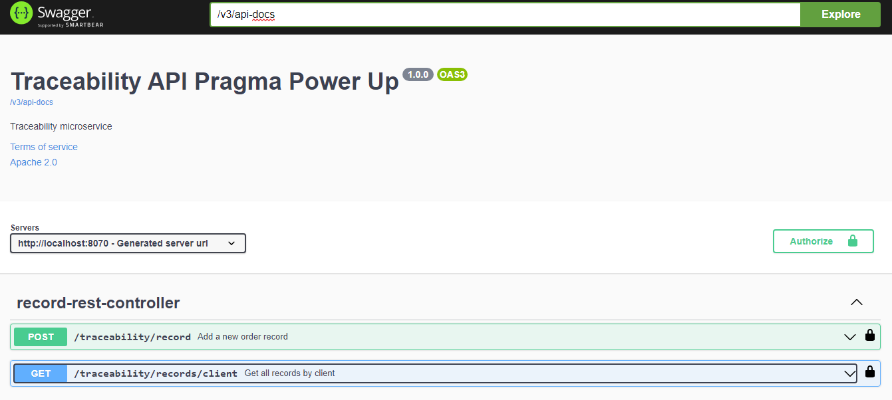
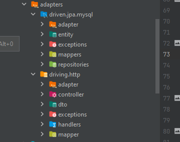
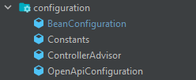
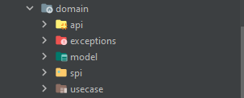

 

<h3 align="center">PRAGMA POWER-UP</h3>
  

    

    This repository contains the 
  

   

      The implementation of this microservice

   

### Built With

* 
* 
* 
* 

### Steps to keep in mind
It contains the connection 

### Built With

* 
* 
* 
* 

### Prerequisites

* JDK 17 [https://jdk.java.net/java-se-ri/17](https://jdk.java.net/java-se-ri/17)
* Gradle [https://gradle.org/install/](https://gradle.org/install/)
* MySQL [https://dev.mysql.com/downloads/installer/](https://dev.mysql.com/downloads/installer/)

### Recommended Tools
* IntelliJ Community [https://www.jetbrains.com/idea/download/](https://www.jetbrains.com/idea/download/)
* Postman [https://www.postman.com/downloads/](https://www.postman.com/downloads/)

<!-- GETTING STARTED -->
## Getting Started

To get a local copy up and running follow these steps:

1. Clone the repository
2. Create a database in MongoDB Compass with the Traceability and  collections Records
3. Run the microservice by right clicking on the TraceabilityMicroserviceApplication file and then on run
4. The port on which the microservice runs is 8070 which can be modified by entering the application-dev.yml file.
5. The documentation of the code is in the following link
   http://localhost:8070/swagger-ui/index.html#

<!-- ROADMAP -->
## Tests

Right-click the test folder and choose Run tests with coverage:
- JUnit5 - Library used for testing
  

- Mockito - Framework used for code testing
  

- Jacoco - Test coverage tool
  

### Microservice structure

- Layer adpters
  

- Layer configuration
  

- Layer domain
  

### Author
[@LilianaGallego](https://github.com/LilianaGallego) - Liliana Gallego

